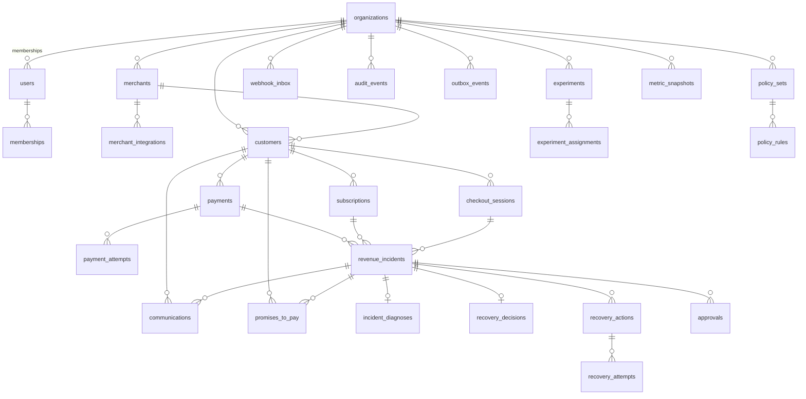

# RecoverAI — Data Model (ER)

## Conventions

- **UUID** primary keys (`gen_random_uuid()`; UUIDv7 noted for adoption when PG 18 matures — see ADR-002).
- **Money**: `BIGINT` in smallest currency units (paise) + `CHAR(3)` currency. **Never floats.**
- **Tenant scoping**: every merchant-owned table carries `org_id` (FK → organizations), resolved from the authenticated principal.
- **Optimistic locking**: `version BIGINT` on stateful entities (payments, incidents, actions, promises, policy sets).
- **State integrity**: `CHECK` constraints on canonical state machines + application-level transition validation.
- **Audit**: `audit_events` is append-only; no update/delete API exists for it.
- **Idempotency**: unique keys — `webhook_inbox(provider, provider_event_id)`, `recovery_actions(idempotency_key)`, `payment_attempts(provider_payment_id, attempt_no)`.

## Entity relationship diagram



## Table inventory (29 tables)

| Table | Purpose | Key columns / constraints |
|---|---|---|
| organizations | SaaS tenants | name, slug UNIQUE, plan, status |
| users | login principals | email UNIQUE, password_hash (bcrypt), status |
| memberships | user↔org with role | (org_id, user_id) UNIQUE, role OWNER/ADMIN/OPERATOR/ANALYST/VIEWER |
| merchants | merchant entities | org_id, name, status, currency |
| merchant_integrations | provider credentials | org_id, merchant_id, provider, mode (TEST/LIVE), encrypted key/secret/webhook_secret, status |
| customers | payers | org_id, merchant_id, customer_ref, email, phone, segment, opt_out_at, channel_prefs jsonb |
| payments | normalized payments | provider_payment_id, status CHECK, amount_minor, failure_reason, failure_category, payment_method, version |
| payment_attempts | per-attempt facts | payment_id, attempt_no, provider_attempt_id, result, raw jsonb |
| subscriptions | subscription lifecycle | provider_subscription_id, status, cadence, current_period_end |
| checkout_sessions | abandonment tracking | provider_session_id, status (CART_CREATED…PAYMENT_COMPLETED), amount_minor, abandoned_at |
| webhook_inbox | raw webhook ledger | UNIQUE(provider, provider_event_id), payload_hash, raw_payload jsonb, processing_status, retry_count |
| revenue_incidents | the core entity | status CHECK (18 states), failure_category, amount_minor, selected_strategy, confidence, attempts_count, contact_count, recovered_amount_minor, version |
| incident_diagnoses | diagnosis facts | incident_id, layer (DETERMINISTIC/AI/HYBRID), failure_category, confidence, evidence jsonb, model_version |
| recovery_strategies | strategy catalog | code UNIQUE, name, requires_adapter, is_active |
| recovery_decisions | decision record | incident_id, candidates jsonb, chosen_strategy, reason, model_version, policy_result, confidence |
| recovery_actions | scheduled/executed actions | incident_id, strategy, status, scheduled_for, idempotency_key UNIQUE, version |
| recovery_attempts | execution outcomes | action_id, attempt_no, outcome, recovered_amount_minor |
| communications | outbound messages | channel, status, body_redacted, simulated flag, sent_at |
| promises_to_pay | P2P workflow | status (PROMISED/SCHEDULED/DUE/FULFILLED/MISSED/CANCELLED), promised_at, confidence, version |
| policy_sets | bounded merchant config | max_retries, max_contact_attempts, max_discount_percent, recovery_window_hours, require_approval_above_amount, allow_* flags |
| policy_rules | extensible rules | policy_set_id, rule_type, params jsonb, enabled |
| approvals | human-in-the-loop | incident_id, proposal jsonb, status, decided_by, decided_at |
| audit_events | immutable ledger | event_type, actor_type/actor_id, previous_state, new_state, decision_input/output snapshots jsonb, correlation_id, trace_id |
| outbox_events | transactional outbox | aggregate_type/id, event_type, payload jsonb, status, attempts, next_attempt_at |
| experiments | batch evaluation runs | seed, population_size, baseline/treatment config jsonb, results jsonb, status |
| experiment_assignments | per-incident arms | experiment_id, incident_key, arm CONTROL/TREATMENT, outcome jsonb |
| metric_snapshots | pre-aggregated analytics | period, metrics jsonb |
| recovery_strategy_stats | (view) strategy performance | derived by analytics query |

## Indexes (from query patterns — see §46 of master plan)

```sql
-- tenant + recency
CREATE INDEX idx_incidents_tenant_created  ON revenue_incidents (org_id, created_at DESC);
CREATE INDEX idx_incidents_tenant_status   ON revenue_incidents (org_id, status);
CREATE INDEX idx_incidents_next_action     ON revenue_incidents (next_action_at) WHERE next_action_at IS NOT NULL;
CREATE INDEX idx_payments_tenant_created   ON payments (org_id, created_at DESC);
CREATE INDEX idx_payments_provider_paid    ON payments (provider_payment_id);
CREATE INDEX idx_customers_tenant_created  ON customers (org_id, created_at DESC);
CREATE INDEX idx_audit_tenant_incident     ON audit_events (org_id, incident_id, timestamp DESC);
CREATE INDEX idx_outbox_status             ON outbox_events (status, next_attempt_at) WHERE status = 'PENDING';
CREATE INDEX idx_webhook_inbox_processed   ON webhook_inbox (processing_status, received_at);
CREATE INDEX idx_actions_scheduled         ON recovery_actions (status, scheduled_for) WHERE status = 'SCHEDULED';
CREATE INDEX idx_comm_tenant_created       ON communications (org_id, created_at DESC);
```

## Analytics strategy

Operational dashboards read from `metric_snapshots` (rolled up hourly + on demand) and
bounded aggregate queries (all tenant-scoped). Full SQL definitions live in Flyway
migrations `V3__analytics.sql`. The scaling path toward ClickHouse/warehouse is documented
in `docs/architecture/scaling.md`.
