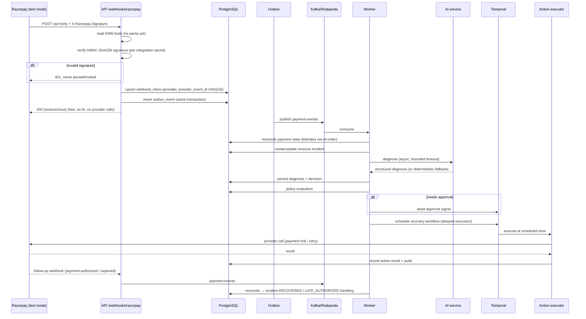

# RecoverAI — Event Flow & Event Catalog

## 1. Webhook ingestion (mission-critical path)



## 2. Event catalog

| Topic | Producer | Payload shape (key fields) | Consumers |
|---|---|---|---|
| `payment-events` | outbox (webhook/processor) | event_id, event_type, provider_payment_id, amount_minor, currency, status, failure_code, occurred_at | Recovery Worker, Metrics Worker |
| `subscription-events` | outbox | event_id, event_type, provider_subscription_id, status, phase, failure_code | Recovery Worker, Metrics Worker |
| `recovery-incidents` | API domain | incident_id, tenant_id, status, failure_category, amount_minor | Audit Worker, Metrics Worker, Analytics |
| `recovery-actions` | API domain / worker | action_id, incident_id, strategy, status, scheduled_for | Audit Worker, Metrics Worker |
| `recovery-results` | worker | incident_id, action_id, outcome, recovered_amount_minor | Metrics Worker, Dashboard |
| `audit-events` | API domain (outbox) | event_type, actor, entity, before/after snapshots | Audit Worker (fan-out to search/archive) |
| `notification-events` | worker | communication_id, channel, status, simulated | Metrics Worker |
| `dead-letter-events` | any consumer | original_topic, key, payload, error, attempts | DLQ monitor, System Health |

### Event shape (canonical)

```json
{
  "schemaVersion": 1,
  "eventId": "evt_9f8d...",
  "eventType": "PAYMENT_FAILED",
  "occurredAt": "2026-08-22T12:00:00Z",
  "tenantId": "0190f1...",
  "correlationId": "8f2c...",
  "payload": { "...": "..." }
}
```

### Out-of-order tolerance

Webhook delivery order is **never assumed**. All handlers are designed as
*reconciliation*: they apply state transitions that are valid from any current state
(e.g. `FAILED → AUTHORIZED` is legal and triggers late-authorization handling;
`CAPTURED` is terminal for collection purposes). Duplicates are deduplicated by the
`webhook_inbox (provider, provider_event_id)` unique constraint and by idempotency keys.

## 3. Transactional outbox

1. Business transaction updates state and inserts `outbox_events` **in the same DB transaction**.
2. `OutboxPublisher` polls unpublished rows (or emits change events) and publishes to Kafka.
3. On success: row marked `PUBLISHED`. On bounded failure: row marked `DEAD` → DLQ with replay.
4. In `EVENT_DISPATCH_MODE=inline` (demo/dev), the publisher invokes the same consumer
   handlers in-process after commit — identical handler code, no broker required.

## 4. Dead-letter queue

- Bounded retries (5) with exponential backoff + jitter, then `DEAD`.
- `dead-letter-events` topic records original topic/key/payload/error/attempts.
- System Health screen shows DLQ count and allows **idempotent replay**.
