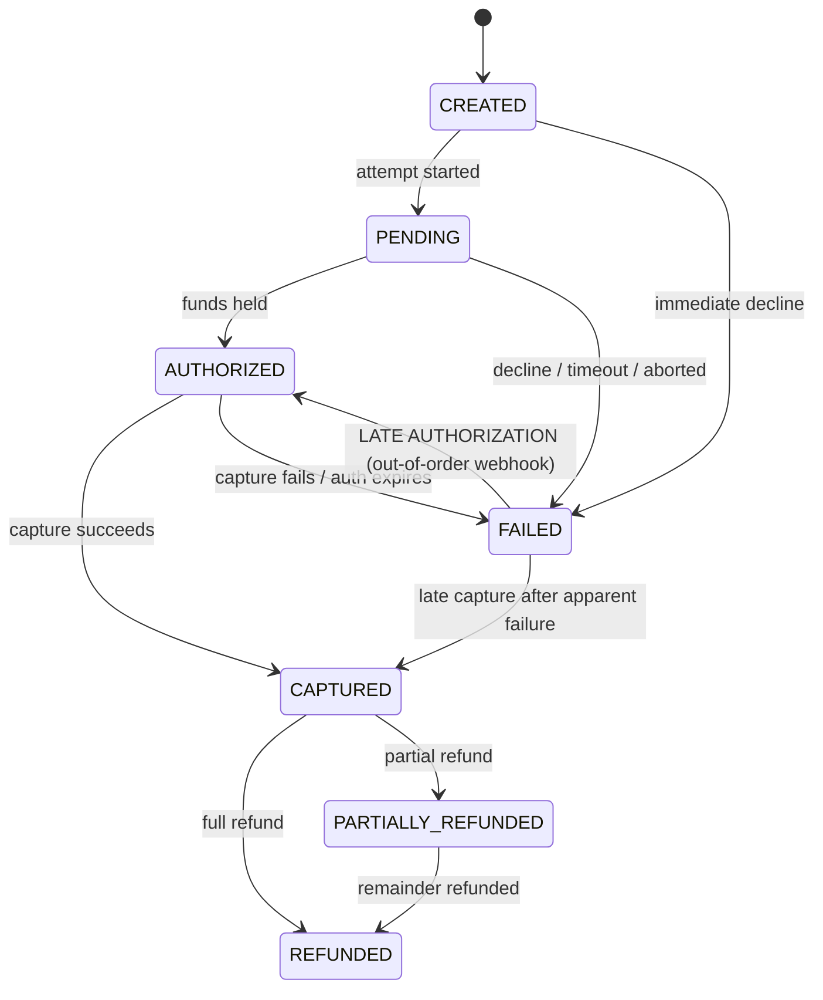

# RecoverAI — Payment State Machine

Payment state is normalized internally; provider-specific details are retained separately
(`payments.provider_failure_details`, `payment_attempts.raw`).

## States

| State | Meaning |
|---|---|
| `CREATED` | order/instrument created, no attempt yet |
| `PENDING` | attempt in flight at the provider |
| `AUTHORIZED` | funds authorized (not yet captured) |
| `CAPTURED` | funds captured — **terminal for collection** |
| `FAILED` | attempt definitively failed |
| `REFUNDED` | captured payment refunded |
| `PARTIALLY_REFUNDED` | captured payment partially refunded |

## Transition rules

**Every transition is validated** by `PaymentStateMachine#transition`. Invalid
transitions (e.g. `CAPTURED → FAILED`) are rejected and logged as anomalies.

## Late authorization (mandatory behavior)

A payment may *appear* failed and later become authorized (webhook delays, bank-side
settlement quirks, async approvals). This is the single most dangerous race in revenue
recovery: retrying an already-authorized payment = **double collection**.

Protocol (implemented in `RecoveryReconciliationService`):

1. `payment.authorized` / `payment.captured` webhook arrives for a payment in `FAILED` state.
2. Payment transitions `FAILED → AUTHORIZED` (or `CAPTURED`), recording the late transition.
3. The incident is transitioned `SCHEDULED/EXECUTING/… → LATE_AUTHORIZED → CLOSED`.
4. Any pending `recovery_action` with status `SCHEDULED/EXECUTING` is **cancelled** (CAS on version, idempotent).
5. Scheduled communications for the incident are suppressed (unless already sent).
6. Audit events: `LATE_AUTHORIZATION_RECEIVED`, `ACTION_CANCELLED`, `INCIDENT_CLOSED`.
7. Metrics: duplicate collection prevented counter increments.

This scenario is covered by automated tests (`LateAuthorizationIT`) and appears in
demo data and the Buildathon demo script (Scene 9).

## Reconciliation before action

Before **any** recovery action that could result in another payment, the current payment
state is re-fetched (Razorpay `GET /v1/payments/{id}` when real credentials exist, mock
provider otherwise) and re-evaluated. If the payment is `AUTHORIZED`, `CAPTURED`, or
`REFUNDED`, the action is aborted and the incident reconciled — no exception.
