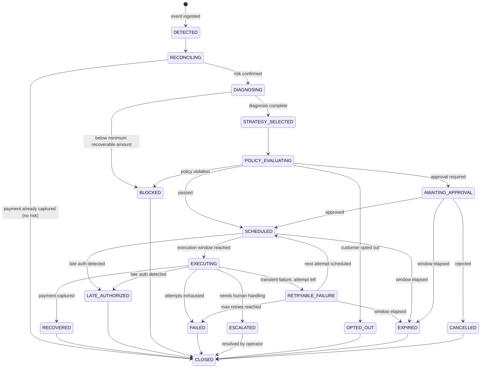

# RecoverAI — Recovery Incident State Machine

`revenue_incidents.status` — the core workflow state. All transitions are validated by
`IncidentStateMachine` and every transition writes an `audit_events` row.

## States

| State | Meaning |
|---|---|
| `DETECTED` | revenue risk observed from an event |
| `RECONCILING` | current provider payment state being verified |
| `DIAGNOSING` | root-cause analysis in progress (deterministic + AI) |
| `STRATEGY_SELECTED` | candidate strategies generated, one chosen |
| `POLICY_EVALUATING` | policy engine checking the chosen strategy |
| `AWAITING_APPROVAL` | human approval required (high value / discount / low confidence) |
| `SCHEDULED` | action scheduled, waiting for execution time |
| `EXECUTING` | action dispatched to provider |
| `RECOVERED` | money collected — **terminal** |
| `RETRYABLE_FAILURE` | attempt failed, another attempt permitted |
| `FAILED` | attempts exhausted / non-retryable — **terminal** |
| `ESCALATED` | handed to human queue |
| `BLOCKED` | policy/stopping rule prevented action |
| `OPTED_OUT` | customer exercised opt-out — **terminal** |
| `EXPIRED` | recovery window elapsed — **terminal** |
| `CANCELLED` | manually cancelled — **terminal** |
| `LATE_AUTHORIZED` | payment authorized after apparent failure — **terminal** (duplicate collection prevented) |
| `CLOSED` | final bookkeeping state after terminal transitions |

## Transition diagram

## Guardrails enforced by the machine

- Terminal states (`RECOVERED`, `FAILED`, `CLOSED`, `LATE_AUTHORIZED`, `OPTED_OUT`,
  `EXPIRED`, `CANCELLED`) reject further transitions except to `CLOSED`.
- `RECOVERED` is only reachable after provider reconciliation shows `CAPTURED`.
- `LATE_AUTHORIZED` is only reachable from `SCHEDULED`/`EXECUTING`/`RETRYABLE_FAILURE`
  and requires a reconciled `AUTHORIZED`/`CAPTURED` payment.
- Every transition is CAS-protected (`version` column) so two concurrent workers cannot
  double-advance an incident.
- No transition may be initiated by the AI service — it has no write path to this table.

## Concurrency

Incident transitions use optimistic locking (`@Version`). `IncidentTransitionService`
retries on `OptimisticLockingFailureException` with the *current* state re-read, so
out-of-order webhook arrivals and concurrent worker executions converge safely.
