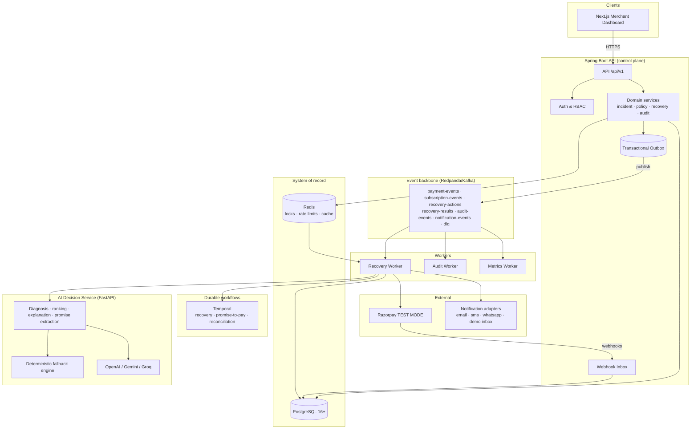

# RecoverAI — System Overview

## Architecture strategy

**Modular monolith for transactional business logic + independently scalable AI and worker components.**

All tenant/business state lives in one transactional service (Spring Boot) so that payment
correctness, idempotency and audit invariants are enforced by a single system of record.
The AI decision service (FastAPI) is a stateless, horizontally scalable advisory component.
Workers (Kafka consumers) and durable workflows (Temporal) scale independently.

Domain boundaries are kept clean so any domain (communication, experiment, analytics)
could be extracted into a service later without schema surgery.



## Key principles

1. **AI recommends. Deterministic software authorizes and executes.** (see ADR-006)
2. **PostgreSQL is the authoritative system of record** for all financial and workflow state (ADR-002).
3. **Events are facts, published via transactional outbox** so DB commit and event publish never diverge (ADR-005).
4. **Webhooks are mission-critical infrastructure**: signature-verified, idempotent, order-tolerant, fast.
5. **Money is integer minor units** (ADR-007).
6. **Workflow state survives process restart** — Temporal for durable timers in production, DB-backed scheduler in demo mode (ADR-004).
7. **Everything is observable**: correlation IDs across the request→event→worker→AI→provider chain, structured JSON logs, Prometheus metrics, Grafana dashboards, tracing hooks.

## Component responsibilities

| Component | Stack | Owns |
|---|---|---|
| `apps/api` | Java 21, Spring Boot, Spring Data JPA, Flyway, Spring Security | tenants, RBAC, payments, incidents, state machines, policy, approvals, audit, analytics, experiments, Razorpay adapter, webhooks, outbox |
| `apps/ai-service` | Python 3.13, FastAPI, Pydantic | structured diagnosis, strategy ranking, explanations, comms content, promise extraction; deterministic fallback; **no financial state** |
| `apps/worker` | Spring Boot (Kafka consumer) + Temporal worker | consuming event streams, executing recovery actions, reconciliation, metrics |
| `apps/web` | Next.js, TypeScript, Tailwind, TanStack Query, Recharts | merchant dashboard (10 screens), approval queue, policy config, system health |

## Runtime topology (local)

```
localhost:3000  → Next.js dashboard (rewrites /api/v1 → :8080)
localhost:8080  → Spring Boot API + Swagger UI (/swagger-ui)
localhost:8100  → AI decision service (/docs)
localhost:9090  → Prometheus
localhost:3001  → Grafana
localhost:8088  → Temporal UI
localhost:9092  → Redpanda (Kafka API)
localhost:5432  → PostgreSQL
localhost:6379  → Redis
```

## Deployment (production path)

Kubernetes manifests/Helm are provided in `infrastructure/`; managed Postgres, Redis,
Redpanda/Kafka and Temporal Cloud are the recommended production topology.
See `docs/architecture/scaling.md`.
