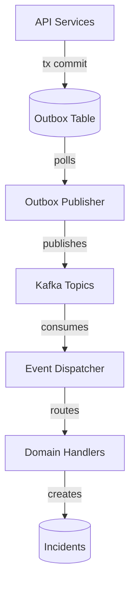

# Event Catalog

This document details the Kafka topics, event types, payloads, and consumers within the RecoverAI platform.

## Kafka Topics

| Topic | Description |
|---|---|
| `checkout-events` | Checkout session lifecycle events (abandonment, completion) |
| `payment-events` | Payment state transitions |
| `subscription-events` | Subscription billing and lifecycle events |
| `recovery-events` | General recovery system events (default if no prefix) |

## Event Payload Envelope

All events published to Kafka are wrapped in a standard envelope schema:

```json
{
  "schemaVersion": 1,
  "eventId": "uuid",
  "eventType": "prefix:action",
  "occurredAt": "ISO-8601",
  "tenantId": "uuid",
  "correlationId": "string",
  "payload": { ... }
}
```

## Domain Events

### Checkout Lifecycle
**Topic**: `checkout-events`
**Consumer**: `EventDispatcher`

| Event Type | Trigger | Payload Structure |
|---|---|---|
| `checkout.started` | User initiates checkout | `checkout_session` or `entity` object |
| `checkout.payment_not_attempted`| User reaches payment step but does not submit | `checkout_session` or `entity` object |
| `checkout.abandoned` | Checkout times out without payment | `checkout_session` or `entity` object |
| `checkout.completed` | Checkout succeeds | `checkout_session` or `entity` object |

### Payment Lifecycle
**Topic**: `payment-events` (or resolved via prefix)
**Consumer**: `EventDispatcher` -> `PaymentService`, `RecoveryOrchestrator`

| Event Type | Trigger | Payload Structure |
|---|---|---|
| `payment.authorized` | Funds reserved | `payment` or `entity` object |
| `payment.captured` | Funds transferred | `payment` or `entity` object |
| `payment.failed` | Payment attempt declined | `payment` or `entity` object |
| `payment.refunded` | Payment refunded | `payment` or `entity` object |

### Subscription Lifecycle
**Topic**: `subscription-events`
**Consumer**: `EventDispatcher`

| Event Type | Trigger | Payload Structure |
|---|---|---|
| `subscription.charged` | Recurring charge succeeded | `subscription` object |
| `subscription.charged.failed` | Recurring charge failed | `subscription` and `payment` objects |
| `subscription.activated` | Subscription becomes active | `subscription` object |
| `subscription.halted` | Subscription suspended (e.g. max retries) | `subscription` object |

## Audit Events
Audit events are recorded synchronously via `AuditService` to the `audit_events` table and track business workflow states:

- `INCIDENT_CREATED`
- `PAYMENT_EVENT_RECEIVED`
- `PAYMENT_RECONCILED`
- `DIAGNOSIS_GENERATED`
- `STRATEGY_SELECTED`
- `POLICY_PASSED` / `POLICY_BLOCKED`
- `ACTION_SCHEDULED` / `ACTION_FAILED`
- `CUSTOMER_OPTED_OUT`
- `PROMISE_REMINDER_SENT`

## Architecture


